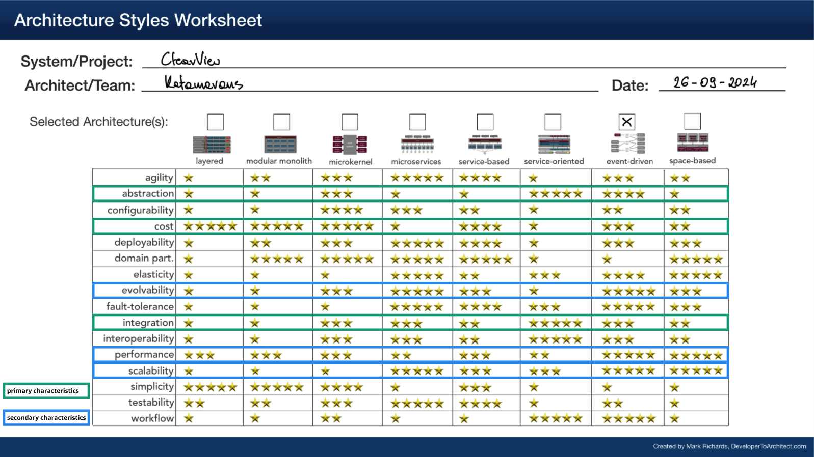

# ADR-008: Selecting Event-Driven Architecture

## Date:
2024-09-25

## Status:
Accepted

## Context:
In [ADR-007](ADR-007-top-3-characteristics.md), team identified abstraction, cost, and integration as the top characteristics guiding the architecture style selection. Besides those three, team picked out performance, scalability, evolvability as an extra characteristics that should be considered during selection. Continuing the work, team explored several architectural patterns to best meet these selections.

## Decision:
The team has decided to adopt an Event-Driven Architecture (EDA) as the architectural style for the system. This architecture supports the system’s need for scalability, performance, and cost-efficiency, while also facilitating abstraction and integration. In an EDA, components communicate asynchronously through events, allowing different parts of the system (HR connectors, AI services) to operate independently, enabling future growth and evolvability with minimal disruption.

**Note:** Given our criteria, three styles emerged as the good candidates: 
microkernel, service-oriented and event-driven architectures. At that moment we also decided to utlize remaining characteristics to aid us in the decision process. Service-oriented was rejected due to high delivery costs and evolvability issue. 
Microkernel was rejected due to problematic scalability.

## Consequences:
### Pros:
- **Loose Coupling and Modularity:** EDA aligns with abstraction by allowing components such as HR connectors and AI services to operate independently, facilitating easy maintenance, updates, and integration without tightly coupling components.
- **Cost Efficiency:** EDA supports cost-efficient operations by allowing components to remain idle until they are triggered by events. This reduces unnecessary resource usage and aligns with the goal of minimizing operational costs while still delivering high performance.
- **Improved Integration:** EDA simplifies integration by enabling components to listen for and react to events, making it easy to add or modify HR system connectors and AI services without requiring extensive rework of the core system.
- **Evolvability and Future-Proofing:** As the system evolves and new technologies, particularly in AI, become available, EDA ensures that these new components can be added with minimal disruption. The architecture can grow with emerging market trends, reducing technical debt and maintaining evolvability.
- **High Performance:** By processing events asynchronously, the system can manage high-volume tasks such as handling large datasets or managing multiple connections without sacrificing performance. EDA supports real-time or near real-time processing, depending on the design of the event queue.

### Cons:
- **Increased Complexity in Event Management:** Managing event flows can become complex as the number of events, HR system connectors, and AI services increases. Ensuring that events are correctly handled and synchronized across the system requires careful design and management.
- **Latency in Event Processing:** Asynchronous processing introduces some potential for delays, especially if event queues grow during high-traffic periods. This could affect real-time performance in certain scenarios where immediate responses are critical (like resume tips engine).
- **Monitoring and Debugging Challenges:** The distributed nature of EDA makes monitoring and debugging more difficult. Understanding the flow of events across various components and tracking down issues in a decentralized system requires robust logging and monitoring tools.
- **Learning Curve:** Implementing and maintaining an event-driven system may require the team to adjust to new development patterns and tools, leading to a learning curve. This could initially slow down development while the team gets familiar with the EDA approach.