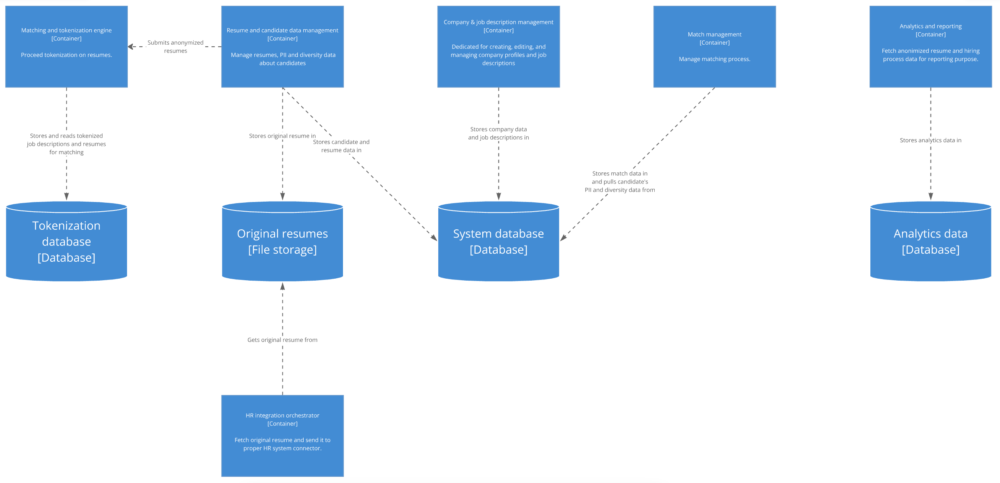

# ADR-013: Storage requirement analysis

## Date:
2024-09-27

## Status:
Accepted

## Context:
The system must handle multiple types of data with distinct requirements, necessitating different storage solutions to ensure optimal performance, security, and scalability. These data types include candidate resumes, system data, and reporting data. Each has unique characteristics and access patterns that need to be accounted for in the system’s architecture.

1. **Original resume storage:** Candidate resumes uploaded to the system in various file formats need to be stored securely and retrieved when required. These resumes should remain in their original form and will only be unlocked and sent to potential employers once unlocked. Therefore, the storage must ensure data integrity, provide scalability for storing large volumes of resume files, and allow for secure access to retrieve these files on demand. Additionally, it must support access control mechanisms to prevent unauthorized access to sensitive candidate information.
2. **System Data:** The system must manage a variety of structured and semi-structured data to support its core functionality. This includes:
    - Candidate and company information, such as personal details (names, contact info), company profiles, and other related metadata.
    - Anonymized resumes, which are processed versions of the original resume PDFs with PII and diversity-related information removed.
    - Job descriptions, detailing the positions companies are looking to fill.
    - Candidate-job matches, which record how well candidates align with posted job descriptions based on tokenized comparisons.
    - HR system connector configurations, storing settings and integrations with external HR platforms.

    The storage for this data needs to be flexible enough to handle different data types (e.g., structured candidate profiles, semi-structured job descriptions) and ensure efficient query performance for operations such as matching candidates with job descriptions. The database must also be scalable and allow for easy modifications as the system evolves, while ensuring data consistency and security.

3. **Tokenized Data for Matching:**	The system will perform a weighted tokenized comparison between job descriptions and anonymized resumes to match candidates with job postings. This data must be stored efficiently to enable quick comparisons during the matching process. The data structure should allow for weights to be attached to tokens.

4. **Reporting Data:** System also needs to support analytics and reporting functionalities, particularly around hiring trends and diversity metrics. This reporting database must be designed to aggregate and analyze data related to hiring practices without storing or exposing any PII. This storage must be capable of handling large-scale aggregated data and support complex queries for reporting.

## Decision:
We will implement three types of storage to handle different data requirements in the system:

1. **Blob Storage:** This storage will hold original resumes uploaded by candidates. These resumes will remain locked unless explicitly unlocked by an employer. Blob storage ensures that the resumes can be securely stored in their original form and retrieved as needed.
2. **General Data Store (SQL database or document-based storage):** This store will manage the bulk of the system’s operational data. The choice between a SQL database or document-based database depends on how structured the data is, but either option will provide the necessary flexibility for system operations.
3. **Tokenized Data Store:** This storage will hold the tokenized job descriptions and anonymized resumes used by the job-candidate matching engine. The storage solution must support weighted tokens and allow for efficient comparisons between tokenized resumes and job descriptions to ensure high performance in the matching process. It must offer fast data access to minimize delays in candidate-job matching operations.
4. **Analytics and Reporting Database:** This storage will handle aggregated analytics and reporting data, such as information about company hiring statistics and candidate diversity. This store will be carefully designed to ensure no PII is stored, complying with privacy regulations while enabling detailed reporting on hiring trends tied to specific job postings.

## Consequences:
### Pros:
1. **Optimized Storage for Different Data Types:** Each storage type is chosen based on the nature of the data being stored. Blob storage is optimized for handling large files like resumes, while the general data store, tokenized data store, and analytics database are designed to handle structured and semi-structured data more efficiently.This prevents bottlenecks and ensures faster retrieval times for resumes, system operations, job matching, and reporting queries.
2. **Security and Privacy Compliance:** By separating storage for sensitive PII (in blob storage and the general data store) from aggregated and anonymized reporting data (in the analytics database), we ensure compliance with privacy regulations like CCPA. This also ensures that reporting data can be used without exposing or storing candidate PII.
3. **Data Segmentation for Better Management and Scalability:** Each data type is isolated into its own storage solution, making it easier to manage, maintain and optimize each store. This ensures that data backup, recovery, and scaling can be handled in a more targeted way without impacting the other components.

### Cons:
1. **Increased Complexity:** Managing four distinct storage systems increases the overall complexity of the architecture. This requires more configuration, maintenance, and monitoring to ensure that all storage types function properly and are well integrated into the system’s workflow.
2. **Higher Operational Costs:** While specialized storage solutions are performance-optimized, they can lead to higher operational costs. Each storage system will have its own maintenance, backup, and security overheads, which may increase overall expenses compared to a simpler, unified storage solution.
3. **Potential Latency in Tokenized Data Store:** Depending on the volume of tokenized data and the complexity of weighted token comparisons, the tokenized data store could experience latency issues during large-scale or high-frequency matching operations, which may impact the user experience if not properly optimized.