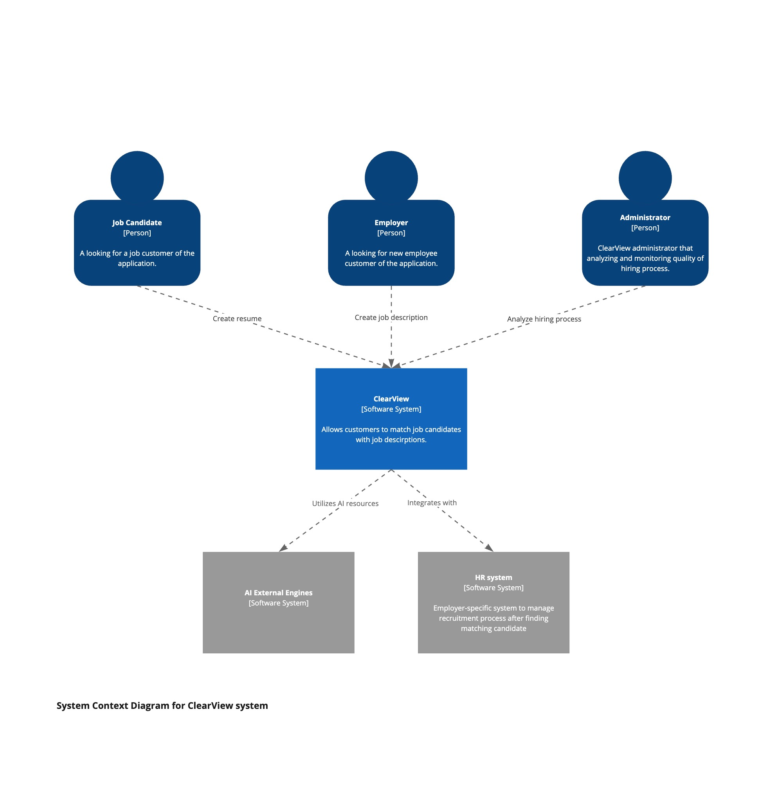

# C4

## System context view (level 1)

C4 Level 1 component diagrams are valuable for creating system architecture as a high-level view of the system, 
enabling clear communication of its structure and components. It helps identify major logical components and their responsibilities, 
making it easier to understand the system's interaction and dependencies without getting bogged down by implementation details. 

ClearView context diagram contains following elements:

* *Job Candidate (Actor)*  - 
* *Employer (Actor)*  -
* *Administrator (Actor)* -
* *ClearView System (Application)* -
* *AI External Engines (Engine)* -
* *HR Systems (Application)* -

## System container diagram

C4 Level L2 container diagram is effective for creating system architecture, it provides a clear and organized view 
of a system's high-level containers and their interactions. This level of abstraction strikes a balance between detail and overview, 
allowing stakeholders to grasp how different components, such as applications, databases and services, fit together within the overall 
system. By showcasing relationships and data flows, it enhances communication among team members and across disciplines, facilitating 
better understanding and collaboration. The diagram also simplifies complexities, making it easier to identify potential integration points, 
dependencies and risk areas, thus serving as a valuable reference throughout the development lifecycle.

The diagram makes it possible to precisely identify the containers that can play a key role in the designed system. In the case of ClearView, these are:

* *Tips engine (AI)*  -
* *Anonymization Engine (AI)*  -
* *Matching and tokenization engine*  -
* *HR integration orchestrator*  - 