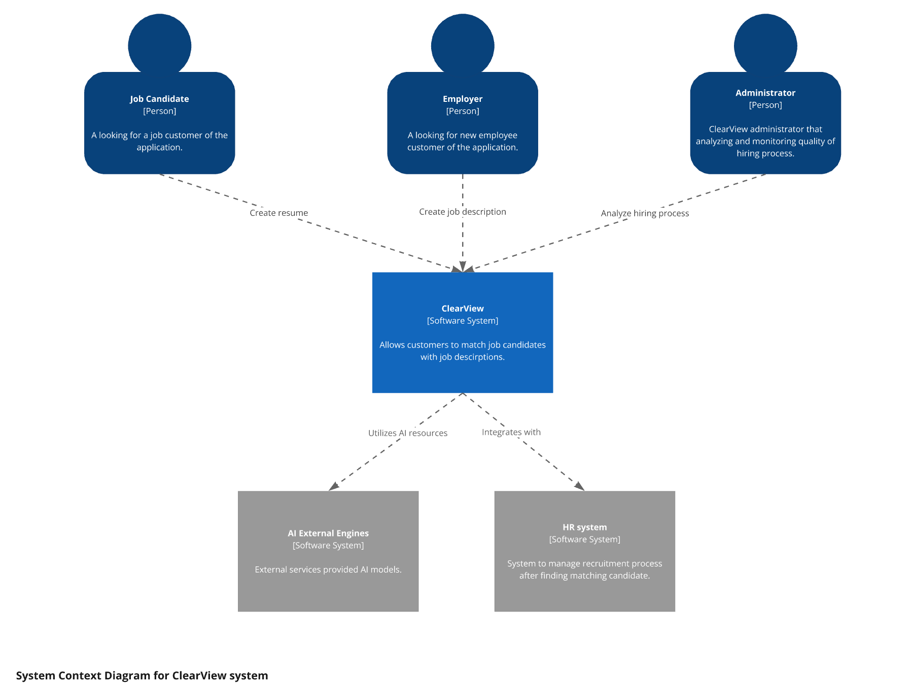

# C4

The C4 model architecture offers a clear and structured approach to visualizing and documenting the architecture of software systems. Its primary advantage lies in its ability to provide different levels of abstraction, allowing stakeholders to understand the system from high-level overviews to detailed components. Overall, the C4 model supports effective documentation, architecture decisions, and ongoing system maintenance.

## System context view (level 1)

C4 Level 1 component diagrams are valuable for creating system architecture as a high-level view of the system, 
enabling clear communication of its structure and components. It helps identify major logical components and their responsibilities, 
making it easier to understand the system's interaction and dependencies without getting bogged down by implementation details. 

ClearView context diagram contains following elements:

* *Job Candidate (Actor)*  - A job candidate is an individual seeking employment opportunities within an organization. 
* *Employer (Actor)*  - The employer is the organization or entity looking to fill job vacancies. They utilize the system 
to post job description, review candidate applications, manage the recruitment process and export the best matched candidates to a dedicated HR system.
* *Administrator (Actor)* - Oversees the HR system, managing user accounts for candidates and employers. Morovoer utilize AI analytics to monitor quality of anonymization and tips engine results.
* *ClearView System (Application)* - Application that anonymized standardized job descriptions and skill-based assessments to ensure that candidates are evaluated primarily on their abilities and qualifications rather than personal characteristics.
* *AI External Services (Application)* - It's refer to third-party applications or tools that integrate 
with the system to leverage artificial intelligence. These services may include tips for resume, tips for company details and anonymize resumes.
* *HR Systems (Application)* - External HR systems are software solutions or platforms that organizations utilize to manage various human resource functions outside ClearView application.

## System container view (level 2)

C4 Level 2 container diagram is effective for creating system architecture, it provides a clear and organized view 
of a system's high-level containers and their interactions. This level of abstraction strikes a balance between detail and overview, 
allowing stakeholders to grasp how different components, such as applications, databases and services, fit together within the overall 
system. By showcasing relationships and data flows, it enhances communication among team members and across disciplines, facilitating 
better understanding and collaboration. The diagram also simplifies complexities, making it easier to identify potential integration points, 
dependencies and risk areas, thus serving as a valuable reference throughout the development lifecycle.

