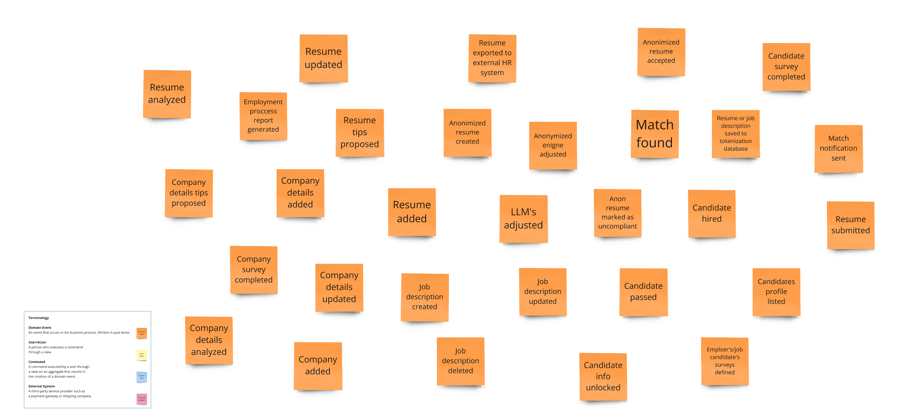
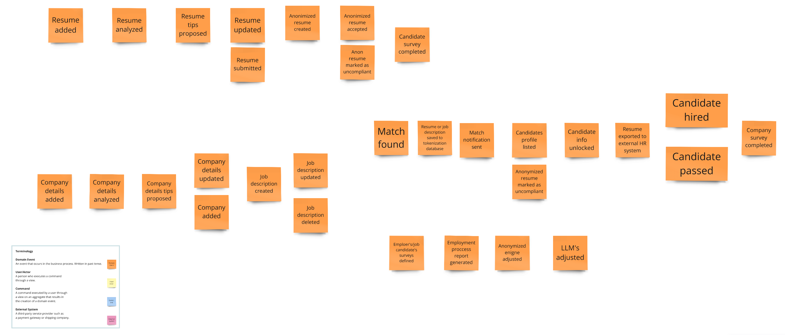
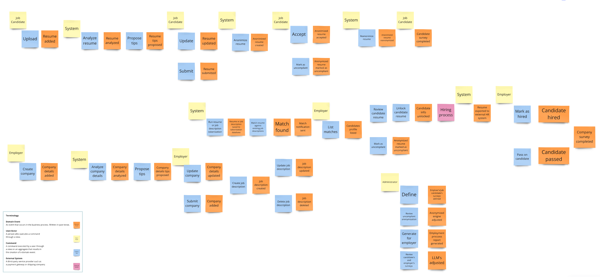
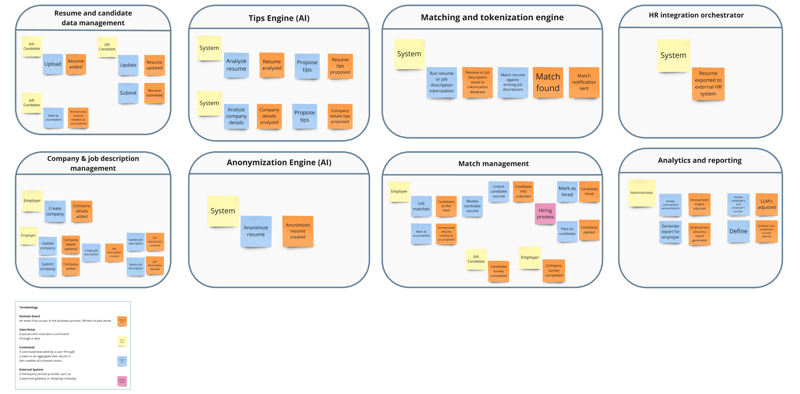

# Event Storming

## Context and Requirements

In today's competitive job market, both candidates and employers are increasingly seeking efficient, fair, and unbiased hiring processes. In an era where diversity and inclusion are paramount, our recruiting application seeks to address common challenges faced by both job seekers and recruiters. By leveraging advanced artificial intelligence, candidates will receive tailored tips to enhance their resumes, ensuring they present their skills and experiences in the best possible light. Additionally, to combat unconscious bias and promote fairness in hiring, the application will include an anonymization feature that obscures personal information, allowing employers to evaluate candidates solely based on their qualifications.

## Collecting events

Collecting events during an Event Storming session is a collaborative and iterative process that allows teams to gain a shared understanding of the current business processes. This foundational knowledge is crucial for designing robust systems that align with business needs. By focusing on events, stakeholders can visualize the flow of information and decisions, ensuring that no critical elements are overlooked in the system design. The resulting event map will serve as a valuable reference for further discussions, modeling, and eventual system implementation.

During the session our team identified following events:

1. **Anonimized resume accepted**: The anonymized resume is received and approved for processing.
2. **Resume exported to external HR system**: The resume is transferred to a third-party HR management system.
3. **Resume updated**: Modifications are made to the existing resume data.
4. **Candidate survey completed**: The candidate has filled out the survey for additional information.
5. **Resume analyzed**: The resume undergoes analysis to extract relevant data.
6. **Anonymized engine adjusted**: The system designed for anonymization is modified for improved performance.
7. **Anonimized resume created**: A new anonymized resume is generated from the original data.
8. **Anonimized resume reanonymized**: The already anonymized resume is processed again to ensure compliance.
9. **Match found**: A suitable candidate-job match is identified by the system.
10. **Employment process report generated**: A report detailing the employment process is created for review.
11. **Resume tips proposed**: Suggestions for improving the resume are generated based on analysis.
12. **Match notification sent**: The candidate is informed about the job match.
13. **Company details tips proposed**: Recommendations for enhancing company information are provided.
14. **Company details added**: New information about the company is incorporated into the system.
15. **LLM's adjusted**: The language models are fine-tuned for better processing effectiveness.
16. **Anon resume marked as uncompliant**: The anonymized resume is flagged for not meeting compliance standards.
17. **Candidate hired**: The candidate is officially offered and accepts the job position.
18. **Resume added**: The resume is incorporated into the system or database.
19. **Resume submitted**: The resume is formally submitted for review or processing.
20. **Company survey completed**: The company has completed the survey to provide insights or feedback.
21. **Job description updated**: The job description is revised to reflect current requirements.
22. **Candidate passed**: The candidate successfully meets all necessary criteria.
23. **Company details updated**: Existing company information is refreshed with new data.
24. **Job description created**: A new job description is drafted for a position.
25. **Company details analyzed**: The submitted company information is evaluated for insights.
26. **Candidate info unlocked**: Additional candidate information is made accessible.
27. **Candidates profile listed**: The candidate's profile is included in the searchable database.
28. **Job description deleted**: An existing job description is removed from the system.
29. **Company added**: A new company profile is created in the system.

## Time sequence

Arranging events in chronological order during event storming is essential for gaining a comprehensive understanding of the system, fostering collaboration, clarifying business logic, and ensuring that the design can accommodate real-world scenarios effectively. It serves as a foundational step in building a clear and shared understanding among all participants involved in the process.

## Actors, commands and external services

Integrating actors, commands, and external services in Event Storming brings clarity, facilitates communication, enhances understanding, and supports a more structured approach to developing complex systems. This comprehensive modeling approach ultimately leads to better-designed software solutions that meet both business requirements and user expectations.

Description of the application actors:

**Job Candidate**: The Job Candidate interacts with the system to upload resumes and apply for job openings. AI algorithms analyze their skills and preferences to assist with interview preparation, and offer feedback on their applications.

**Employer**: The Employer uses the system to post job listings, manage applications, and track candidate progress. AI tools assist in fill company details.

**Administrator**: The Administrator oversees the HR system, managing user accounts for candidates and employers. They utilize AI analytics to monitor quality of anonymization and tips engine results.

**System**: The HR System serves as the centralized platform that connects candidates, employers, and administrators. It employs AI algorithms for resume anonymization and tips for resume and company details. The system ensures a smoother hiring process, improves decision-making, and enhances the overall user experience.

External systems detected:

**HR systems**: Recruitment platforms are used by companies to streamline their hiring processes. These systems allow organizations to manage job postings, applicant data, and recruitment workflows. Our goal is to export unlocked resumes there.

## Grouping events

The goal of grouping events in event storming is to organize and categorize events based on their significance, context, or relationships to identify patterns, dependencies, and opportunities for improvement within a system or process. This practice helps teams gain a clearer understanding of the domain, facilitates communication, and drives the design of more efficient and effective systems by focusing on core business processes and their interactions.

Description of identified application components:

1. **Resume Management**: A system for collecting, organizing, and evaluating applicants' resumes, allowing recruiters to improve the resume by tips driven by AI.

2. **Tips Engine (AI-based)**: An AI-driven feature that provides personalized suggestions and best practices for candidates, helping them improve their resumes, cover letters, and interview performance.

3. **Matching Engine**: An algorithmic tool that compares job descriptions with candidate profiles to identify the best matches based on skills, experience, and other relevant criteria, streamlining the selection process.

4. **Match and Candidate Management**: A centralized component that allows recruiters to track candidates' progress, manage applications, facilitate communication, and oversee the matching process throughout the hiring cycle.

5. **Invoicing**: An automated billing system for managing financial transactions.

6. **HR System Integrations**: The ability to connect and synchronize with existing HR software and systems to enhance data flow, reduce redundancy, and improve overall efficiency in recruitment processes.

7. **Company & Job Description Management**: Tools for creating, editing, and managing company profiles and job descriptions, ensuring consistency and clarity in job postings and employer branding.

8. **Anonymization (AI-based)**: A feature that uses AI to remove identifying information from candidate applications, promoting unbiased recruitment practices and enhancing diversity efforts.

9. **Analytics and Reporting**: A suite of analytical tools that track recruitment metrics, providing insights into hiring trends, candidate sourcing effectiveness, and overall recruitment performance to support strategic decision-making.

10. **User Management**: A module for managing user roles and permissions within the HR application, allowing administrators to control access levels for recruiters and hiring managers while ensuring data security and compliance.

Of which the following components have been identified as key to the system under development:

**Tips Engine (AI-based)**: This component leverages artificial intelligence to analyze user interactions and data patterns, providing personalized recommendations and insights. It enhances user experience by offering tailored suggestions, improving engagement, and driving better decision-making.

**Matching Engine**: The matching engine is vital for connecting users with relevant opportunities, services, or content based on their preferences and profiles. Its effectiveness directly impacts user satisfaction and retention by ensuring that individuals receive what they're looking for quickly and accurately.

**Anonymization (AI-based)**: AI-based anonymization protects user privacy by removing or obfuscating personally identifiable information from datasets. It helps protect the identities of individuals from various backgrounds in datasets, ensuring that sensitive information is not compromised.

**HR System Integrations**: Integrating with HR systems is essential for streamlining workflows, automating processes, and ensuring that user data is synchronized across platforms. This enhances efficiency and allows for better decision-making based on comprehensive data analytics, ultimately supporting talent management and organizational goals.
