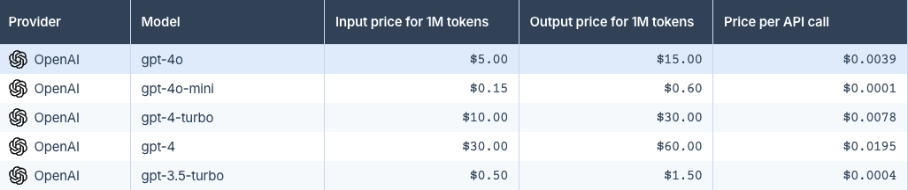

# Cost

## Introduction and assumptions

The goal of that fitness function is to have a control of cost in the system. We are looking for provide a total cost of
single job candidate main flow utilization. In that fitness function we focus on the AI Service cost due to the main impact on total amount.

Assumptions:
* *Resume*  - contains around 300 words to process
* *Processing a resume*  - sending tips ten times and anonymize it twice
* *AI Service*  - OpenAI as a most popular one

## AI Service pricing

To calculate the costs, we will use the calculator available at: https://gptforwork.com/tools/openai-chatgpt-api-pricing-calculator

Model <b>gpt-4o</b> was selected to show an example as a good quality one with reasonable price.

Cost of giving a tips 10 times 300 words: 0,04$
Cost of anonymization 300 words 2 times: 0,02$

Total costs of processing a job candidate through hiring process: <b>0,06$</b>

## Considerations

There are several benefits of taking care about described fitness function:
1. **Maintenance costs**: As the number of users increases, we can easily examine what the cost of maintaining the system will be
2. **Unlock resume pricing**: By taking into account the number of candidates per job description and the number of resume unlocks, 
we can identify a minimal price for unlocking resume so that the whole process does not generate money losses.
3. **Limit of requests generated**: If calling AI services costs are high, we can think about reducing them per candidate.
4. **Compare AI models and providers**: Checking the calculated amount makes it possible to assess whether a change of model or AI service provider is necessary in context of the costs.
5. **In-house model consideration**: If the cost of external services is high, an in-house model may be required.