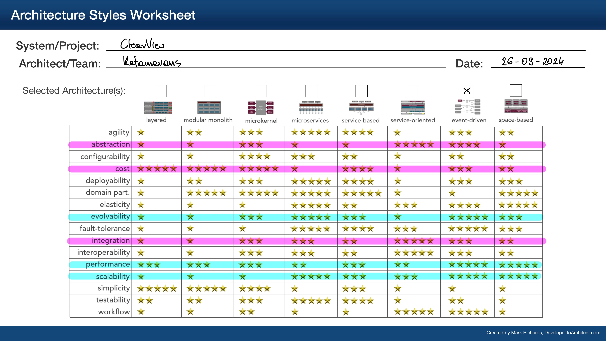

# ClearView by Katamarans

- Dawid Bińczyk
- Kacper Cybula
- Michał Fijałkowski

## Table of Contents

- [Introduction](#introduction)

## Introduction
Business context, Business problem, Requirements, Stakeholders, Constraints, Assumptions, and Dependencies.

Introduction

Discrimination in the recruitment process remains a significant challenge globally. Studies reveal that individuals from marginalized groups, including those with disabilities, women, ethnic minorities, and members of the LGBTQ+ community, face a range of barriers in securing employment. For example, research from Harvard Business Review indicates that ethnic minorities are 24% less likely to receive a callback for an interview compared to equally qualified white applicants 1. Additionally, a report from the UK’s Equality and Human Rights Commission found that 7 in 10 women experience workplace discrimination, particularly during hiring and promotion processes 2. Traditional hiring systems continue to foster unconscious bias, often preventing diverse talent from receiving fair consideration.

Efforts like those of the Diversity Cyber Council, a 501c3 Non-Profit, are aimed at addressing these inequities by serving under-represented demographics in the tech industry. Through education, training, and staffing opportunities, they work to establish a sustainable and diverse talent pipeline for the workforce. However, these initiatives alone are not enough without significant reform in the hiring process itself, which is where our application comes in.

Our platform aims to eliminate discrimination at the early stages of recruitment by removing diversity information, ensuring that hiring decisions are made based solely on objective criteria. By complementing efforts like those of the Diversity Cyber Council, our solution supports the development of a more equitable, inclusive job market.
Problem Statement

The current hiring landscape faces several challenges in promoting fairness and eliminating bias:

    Problem #1: There is a lack of impactful metrics that accurately identify and reduce potential biases in the job candidate hiring and interview process. Many existing systems rely on diversity data early in the recruitment process, which can introduce bias rather than prevent it. Our approach eliminates diversity information at the early stages, ensuring that decisions are based solely on objective qualifications and experience.

    Problem #2: Traditional Applicant Tracking Software (ATS) often proves redundant and ineffective in matching viable candidates with job descriptions. This inefficiency leads to missed opportunities, as qualified applicants are frequently overlooked or poorly matched to roles due to inadequate filtering mechanisms.

Our solution removes diversity data from the initial screening process, creating an unbiased and objective hiring process that focuses solely on the merits of each candidate.
Sources

Let me know if this version is good!
Footnotes

    Harvard Business Review: "Minorities Who 'Whiten' Resumes Get More Job Interviews" ↩

    Equality and Human Rights Commission: "Sex Discrimination in the Workplace" ↩

## Requirements destination

## Domain exploration

The [Event Storming](EventStorming/EventStorming.md) technique was used to identify the events of the system, order them in time and determine the contexts of the ClearView application.

## Logical separation

A broad view of Event Storming allowed to define the ClearView components. Taking into account the business requirements and key 
technical aspects, it was possible to identify which components were crucial for further analysis of the architecture.

## Key Architecture Challenges

During the requirements analysis, understanding of the business purpose and proceeding Event Storming technique, the following key architecture challenges were identified
1. External AI Services security and costs.
2. External HR systems integration.
3. Secure PII processing to support analysis and reporting.

## Architecture characteristics

## Architecture style selection

## Bird's eye system view

The diagram below shows how to organise the designed system using the first level of [C4 model](C4/C4.md). First of all, basing the architecture on events does not mean 
using them for every communication.  The use of HTTP connections will work well for querying external AI systems. 
On the other hand, the communication between the connectors of external HR systems and these systems is not strictly 
defined and depends on the analysis of the systems to be connected to. Leaving these decisions to the development 
team will allow to better addressed coming challenges.

## Fitness Functions

| Fitness Function                                               | Description                                                                                                                                                          | Tested Characteristic |
|----------------------------------------------------------------|----------------------------------------------------------------------------------------------------------------------------------------------------------------------|-----------------------|
| [Cost](FitnessFunctions/Cost.md)                               | The goal of that fitness function is to have a control of cost in the system. We are looking for provide a total cost of single job candidate main flow utilization. | Cost                  |
| [EventHealthFormula](FitnessFunctions/EventHealthFormula.md)   | Defined to evaluate the health and efficiency of the system based on the percentage of failed events.                                                                | Fault Tolerance       |
| [EventualConsistency](FitnessFunctions/EventualConsistency.md) | Set of metrics used to evaluate how well the system is maintaining consistency across its distributed components over time.                                          | Consistency           |

## Team topologies

We considered the application of Team Topologies principles to create an appropriate team distribution across the main
business value streams. Instead of enforcing a rigid team structure, we propose a flexible, non-binding team
organization. Key areas requiring special attention are:

- AI and Machine Learning modules, with a focus on continuous improvement of the AI engine.
- Integration with external HR systems.

Given the relatively low complexity of the core domains, we recommend against splitting the workforce into smaller,
specialized teams. Instead, assigning 2 people to each of these key areas would effectively balance the cognitive load
across the team.

Considering the low budget and startup nature of the project, we advise against creating separate platform teams,
enabling teams, or teams dedicated to complex subdomains.

 

