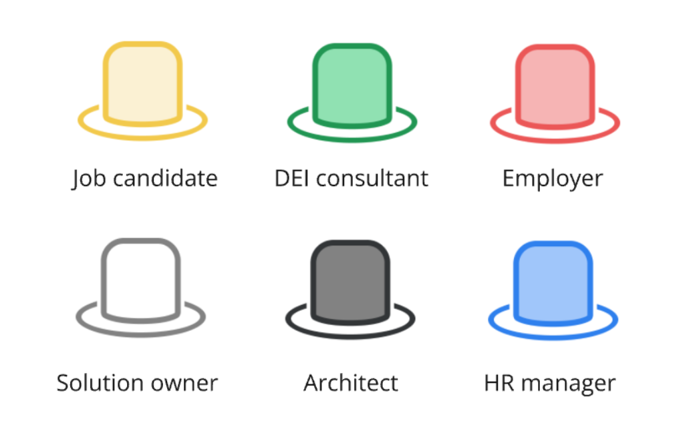
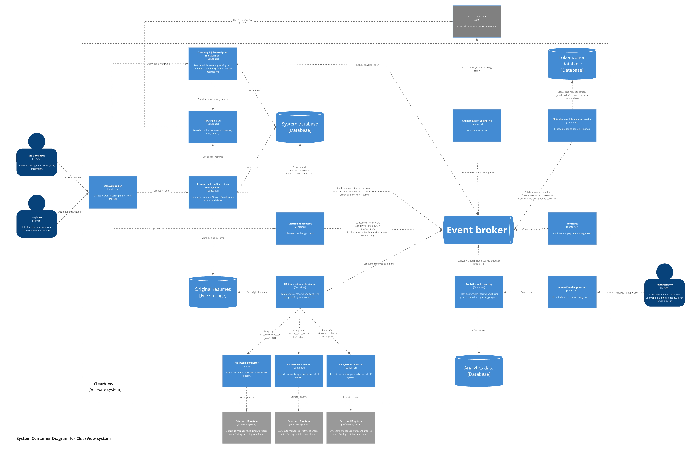

# ClearView by Katamarans

## Team

- Dawid Bińczyk | [LinkedIn](https://www.linkedin.com/in/dawid-binczyk/)
- Kacper Cybula | [LinkedIn](https://www.linkedin.com/in/kacper-cybula/)
- Michał Fijałkowski | [LinkedIn](https://www.linkedin.com/in/michalfijalkowski1/)

## Table of Contents

- [Introduction](#introduction)
- [Requirements destillation](#requirements-distillation)
- [Domain exploration](#domain-exploration)
- [Key Architecture Challenges](#key-architecture-challenges)
- [Architecture characteristics](#architecture-characteristics)
- [Architecture style selection](#architecture-style-selection)
- [Bird's eye system view](#birds-eye-system-view)
- [Example deployment](#example-deployment)
- [Fitness Functions](#fitness-functions)
- [Team topologies](#team-topologies)

## Introduction

Discrimination in the recruitment process remains a significant challenge globally. Studies reveal that individuals from
marginalized groups, including those with disabilities, women, ethnic minorities, and members of the LGBTQ+ community,
face a range of barriers in securing employment process. For example:

- research from Harvard Business School indicates that
  ethnic **minorities are 24% less likely to receive a callback** for an interview compared to equally qualified white
  applicants [^1].
- Additionally, a report from the Pew Research Center found that **42% of women
  experience workplace discrimination** [^2].

Traditional hiring systems continue to foster unconscious bias, often preventing diverse talent from receiving fair
consideration.

Efforts like those of the [Diversity Cyber Council](https://www.diversitycybercouncil.com/), a 501c3 Non-Profit, are
aimed at addressing these inequities by serving under-represented demographics in the tech industry. Through education,
training, and staffing opportunities, they work to establish a sustainable and diverse talent pipeline for the
workforce. However, these initiatives alone are not enough without significant reform in the hiring process itself,
which is where our application comes in.

### Problem Statement

The current hiring landscape faces several challenges in promoting fairness and eliminating bias:

1. There is a **lack of impactful metrics** that accurately identify and reduce potential biases in the job candidate
   hiring and interview process. Many existing systems rely on diversity data early in the recruitment process, which
   can introduce bias rather than prevent it. Our approach eliminates the diversity of information at the early stages,
   ensuring that decisions are based solely on objective qualifications and experience.
2. Traditional Applicant Tracking Software (ATS, called in this repo HR system) often proves redundant and **ineffective
   in matching** viable
   candidates with job descriptions. This inefficiency leads to missed opportunities, as qualified applicants are
   frequently overlooked or poorly matched to roles due to inadequate filtering mechanisms.

Our solution removes diversity data from the initial screening process, creating an unbiased and objective hiring
process that focuses solely on the merits of each candidate.
Sources

[^1]: Harvard Business School: ["Minorities Who 'Whiten' Resumes Get More Job Interviews"]
(https://hbswk.hbs.edu/item/minorities-who-whiten-job-resumes-get-more-interviews)

[^2]: Pew Research Center: ["Gender discrimination comes in many forms for today’s working women"]
(https://www.pewresearch.org/short-reads/2017/12/14/gender-discrimination-comes-in-many-forms-for-todays-working-women/)

## Requirements distillation

To achieve effective requirement distillation, we employed a collaborative approach involving key stakeholders,
including hiring managers, DEI consultants, and potential users point of views. Through workshops we gathered insights
and identified pain points in the current hiring processes. This information was then analyzed to prioritize features
that align with our core mission of bias reduction and efficiency. The distilled requirements are detailed in the
following sections: [Functional Requirements](Requirements/DistilledRequirements.md#distilled-functional-requirements)
and [Non-Functional Requirements](Requirements/DistilledRequirements.md#distilled-non-functional-requirements), ensuring
the platform delivers maximum user value.

To achieve effective requirement distillation, we employed a collaborative approach using the "Six Thinking Hats"
technique. In place of direct stakeholder meetings, we identified key perspectives represented by six hats: job
candidate, DEI consultant, employer, solution owner, architect, and HR manager. Each "hat" brought a different viewpoint
to the table, helping us explore all dimensions of the hiring process from user experience to technical feasibility.

  

This method allowed us to rigorously evaluate and prioritize features based on their impact and alignment with our
goals. Its success led us to continue using it in later phases, including the creation of the solution architecture,
ensuring a well-rounded approach throughout.

Additionally, we employed usability testing and scenario-based evaluations to assess how well the proposed requirements
would function in real-world applications. This process helped us identify any gaps or inconsistencies, allowing for
refinements that enhance both the user experience and overall system functionality. By validating our requirements in
this manner, we aim to create a robust foundation for our hiring platform that effectively meets the needs of all users.

## Domain exploration

The [Event Storming](EventStorming/EventStorming.md) technique was used to identify the events of the system, order them
in time and determine the contexts of the ClearView application.

A broad view of Event Storming allowed us to define ClearView components crucial for further analysis of the architecture.

## Key Architecture Challenges

During the requirements analysis, understanding of the business purpose and proceeding Event Storming technique, the
following key architecture challenges were identified

1. External AI Services security and costs.
2. External HR systems integration.
3. Secure Personally Identifiable Information (PII) processing to support analysis and reporting.

## Architecture characteristics

When approching the project it became obvious that the project will be operating under few assumptions:

- Considering client is a non-profit organisation with limited funding, one of the primary characteristics would be
  [**cost** described in ADR-002](ADR/ADR-002-cost-as-selected-characteristic.md).
- Because the designed system has to integrate with various existing and new HR systems through use of connectors, it
  was decided to pick
  [**abstraction and integration** (ADR-004)](ADR/ADR-004-abstraction-and-integration-as-additional-characteristics.md)
  as the other two primary characteristics.
- We are going to
  use [AI technologies which change very rapidly (ADR-005)](ADR/ADR-005-changing-AI-solution-landscape.md), because of
  that we had to consider **evolvability** as a secondary characteristic supporting abstraction and integration.
- Client wants to use AI in few modules which can directly affect the user experience. Following up on the decision
  about the evolving AI market, model efficiency and costs we decided to pick
  [**performance and scalability** (ADR-003)](adr/ADR-003-ai-performance-considerations.md)
  as our last secondary characteristics

During event storming, we identified several key system components that were later visualized on C4 diagrams.

Out of these, we picked core three components:

- **Tips AI Engine** generating tips during company registration and resume improvements,
- **Anonymization AI Engine** processing candidate resumes, removing all PII and diversity data from them,
- **HR integration orchestrator** managing multiple connectors pushing data to employer's HR system.

Additionally, during characteristics selection we decided to account for two components that have special security
requirements:

- **Resume and candidate management** component that handles PII and diversity data that can be linked to the candidate
- **Analytics & reporting** processing large amounts hiring and candidate diversity data that are not directly linked to
  the candidates, but to the job postings and companies instead.

Even though **security** is emphasized in [ADR-009](ADR/ADR-009-PII-data-safety.md), it is one of the implict
characteristics and because of that, it was not considered when picking the Top 3.

Integration characteristic described
in [ADR-004](ADR/ADR-004-abstraction-and-integration-as-additional-characteristics.md) is assigned only to one of the
components, but it was selected as Top 3 characteristic because of the business model and possible large count of HR
systems this system can integrate with.

## Architecture style selection

After selecting [Top 3 characteristics (ADR-007)](ADR/ADR-007-top-3-characteristics.md) we moved on to the architectural
style selection. Given our criteria, three styles emerged as the good candidates: 
microkernel, service-oriented and event-driven architectures. At that moment we also decided to utlize remaining characteristics to aid us in the decision process. Service-oriented was rejected due to high delivery costs and evolvability issue. Microkernel was rejected due to problematic scalability.

Our consideration led us to the event-driven architecture as our target architecture.

This decision is described in more detail in [ADR-008](ADR/ADR-008-architecture-style-selection.md), but key benefits
are low cost, ease of introducing changes and high performance

## Bird's eye system view

The diagram below shows how to organise the designed system using the second level of [C4 model](C4/C4.md). First of all,
basing the architecture on events does not mean
using them for every communication. HTTP connections will work well for querying external AI systems.
On the other hand, the communication between the connectors of external HR systems and these systems is not strictly
defined and depends on the analysis of the systems to be connected to. Leaving these decisions to the development
team will allow to better addressed coming challenges.

## Example deployment
To test out validity of our architecture we started thinking how the deployment of an entire system would look like. Outcome of that, was this example Azure deployment diagram. More detailed description can be found in [deployment example document](Deployment/001-deployment-example.md).

## Fitness Functions

| Fitness Function                                                   | Description                                                                                                                                                          | Tested Characteristic |
|--------------------------------------------------------------------|----------------------------------------------------------------------------------------------------------------------------------------------------------------------|-----------------------|
| [Cost](FitnessFunctions/Cost.md)                                   | The goal of that fitness function is to have a control of cost in the system. We are looking for provide a total cost of single job candidate main flow utilization. | Cost                  |
| [EventHealthFormula](FitnessFunctions/EventHealthFormula.md)       | Defined to evaluate the health and efficiency of the system based on the percentage of failed events.                                                                | Fault Tolerance       |
| [EventualConsistency](FitnessFunctions/EventualConsistency.md)     | Set of metrics used to evaluate how well the system is maintaining consistency across its distributed components over time.                                          | Consistency           |
| [SensitiveDataSecurity](FitnessFunctions/SensitiveDataSecurity.md) | Protection of sensitive data (Personally Identifiable Information) through component access control and data encryption                                              | Security              |

## Team topologies

We considered the application of Team Topologies principles to create an appropriate team distribution across the main
business value streams. Instead of enforcing a rigid team structure, we propose a flexible, non-binding team
organization. Key areas requiring special attention are:

- AI and Machine Learning modules, with a focus on continuous improvement of the AI engine.
- Integration with external HR systems.

Given the relatively low complexity of the core domains, we recommend against splitting the workforce into smaller,
specialized teams. Instead, assigning 2 people to each of these key areas would effectively balance the cognitive load
across the team.

Considering the low budget and startup nature of the project, we advise against creating separate platform teams,
enabling teams, or teams dedicated to complex subdomains.

 

