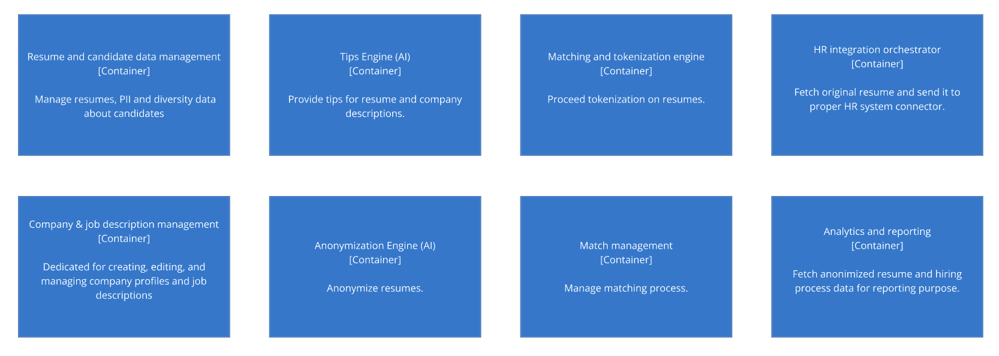

# ClearView by Katamarans

- Dawid Bińczyk
- Kacper Cybula
- Michał Fijałkowski

## Table of Contents

- [Introduction](#introduction)

## Introduction
Business context, Business problem, Requirements, Stakeholders, Constraints, Assumptions, and Dependencies.

## Requirements destination

## Domain exploration

The [Event Storming](EventStorming/EventStorming.md) technique was used to identify the events of the system, order them in time and determine the contexts of the ClearView application.

## Logical separation

## Key Architecture Challenges

During the requirements analysis, understanding of the business purpose and proceeding Event Storming technique, the following key architecture challenges were identified
1. External AI Services security and costs.
2. External HR systems integration.
3. Secure PII processing to support analysis and reporting.

## Architecture characteristics

## Architecture style selection

## Bird's eye system view

The diagram below shows how to organise the designed system using the first level of [C4 model(C4/C4.md). First of all, basing the architecture on events does not mean 
using them for every communication.  The use of HTTP connections will work well for querying external AI systems. 
On the other hand, the communication between the connectors of external HR systems and these systems is not strictly 
defined and depends on the analysis of the systems to be connected to. Leaving these decisions to the development 
team will allow to better addressed coming challenges.

## Fitness Functions

| Fitness Function                                               | Description                                                                                                                                                          | Tested Characteristic |
|----------------------------------------------------------------|----------------------------------------------------------------------------------------------------------------------------------------------------------------------|-----------------------|
| [Cost](FitnessFunctions/Cost.md)                               | The goal of that fitness function is to have a control of cost in the system. We are looking for provide a total cost of single job candidate main flow utilization. | Cost                  |
| [EventHealthFormula](FitnessFunctions/EventHealthFormula.md)   | Defined to evaluate the health and efficiency of the system based on the percentage of failed events.                                                                | Fault Tolerance       |
| [EventualConsistency](FitnessFunctions/EventualConsistency.md) | Set of metrics used to evaluate how well the system is maintaining consistency across its distributed components over time.                                          | Consistency           |

## Team topologies

We considered the application of Team Topologies principles to create an appropriate team distribution across the main
business value streams. Instead of enforcing a rigid team structure, we propose a flexible, non-binding team
organization. Key areas requiring special attention are:

- AI and Machine Learning modules, with a focus on continuous improvement of the AI engine.
- Integration with external HR systems.

Given the relatively low complexity of the core domains, we recommend against splitting the workforce into smaller,
specialized teams. Instead, assigning 2 people to each of these key areas would effectively balance the cognitive load
across the team.

Considering the low budget and startup nature of the project, we advise against creating separate platform teams,
enabling teams, or teams dedicated to complex subdomains.

 

